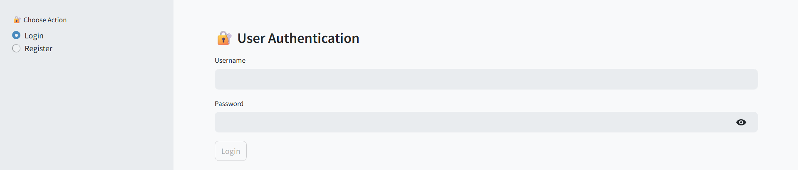
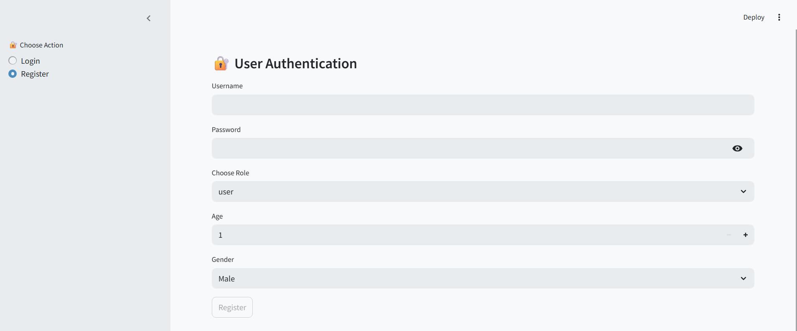
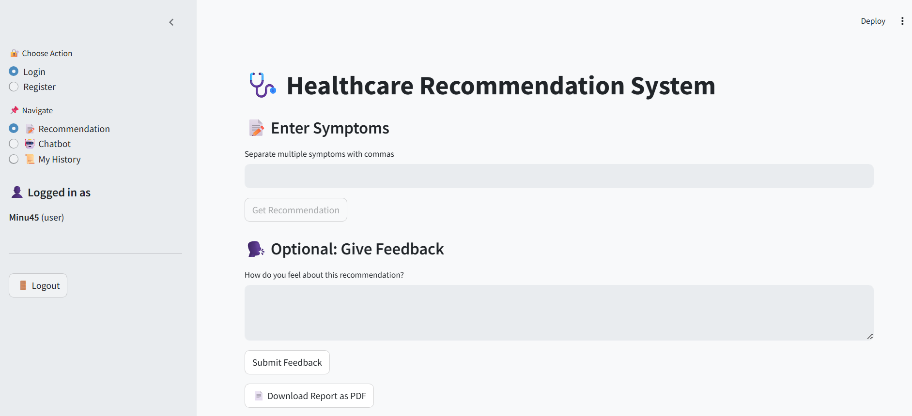
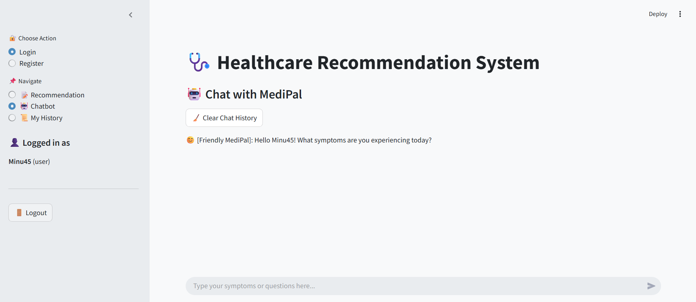
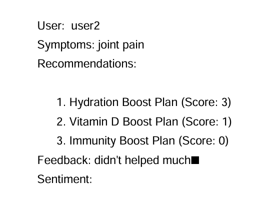
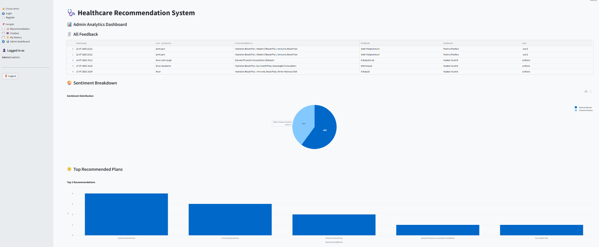
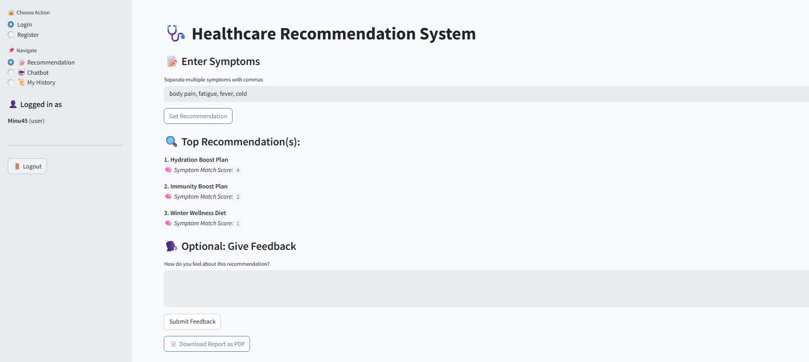

# 🩺 Healthcare Recommendation System

An intelligent healthcare recommendation platform built with Python and Streamlit that provides personalized health recommendations based on user symptoms, analyzes user feedback using Natural Language Processing (NLP), generates downloadable PDF reports, and offers real-time analytics through an admin dashboard.

The system is designed to assist users in identifying potential health concerns, finding relevant healthcare facilities, and tracking interactions through a user-friendly interface.

---

## 🚀 Features

### 👤 User Module

- Secure User Registration & Login
- Symptom-Based Health Recommendations
- Interactive Healthcare Chatbot
- User Activity History Tracking
- Downloadable PDF Health Reports

### 🤖 AI & NLP Features

- Sentiment Analysis of User Feedback
- Intelligent Recommendation Engine
- Context-Aware Health Suggestions

### 📊 Admin Dashboard

- User Analytics
- Recommendation Usage Statistics
- Feedback Sentiment Insights
- Interactive Visualizations using Plotly

---

## 🛠️ Tech Stack

### Frontend
- Streamlit

### Backend
- Python

### Data Processing
- Pandas
- NumPy

### Visualization
- Plotly

### Natural Language Processing
- TextBlob
- NLTK

### PDF Report Generation
- ReportLab

### Data Storage
- CSV Files
- Excel Files

---

## 📂 Project Structure

```text
Healthcare_Recommendation_System/
│
├── app.py
├── recommendation.py
├── sentiment.py
├── logger.py
├── requirements.txt
├── README.md
├── auth_config.py
├── migrate_users.py
├── temp_create_users.py
├── test_rec.py
├── utils.py
│
├── data/
│   ├── users.csv
│   ├── hospital_list.xlsx
│   └── logs.csv
│
├── reports/
│
└── screenshots/
    ├── admin-dashboard.png
    ├── chatbot-interface.png
    ├── login-page.png
    ├── registration-page.png
    ├── symptom-recommendation-screen.png
    ├── pdf-report.png
    └── sentiment-analysis-results.png
```

---

## 📸 Screenshots

### 🔐 Login Page



---

### 📝 Registration Page



---

### 💡 Symptom Recommendation Screen



---

### 🤖 Healthcare Chatbot



---

### 📄 PDF Report Generation



---

### 📊 Admin Analytics Dashboard



---

### 😊 Sentiment Analysis Results



---

## 📈 Key Functionalities

### Symptom-Based Recommendations

Users can enter symptoms and receive personalized healthcare recommendations based on predefined medical mappings.

### Sentiment Analysis

User feedback is analyzed using NLP techniques to determine positive, neutral, or negative sentiment.

### PDF Report Generation

Health recommendations and user interactions can be exported as downloadable PDF reports.

### Analytics Dashboard

Administrators can monitor application usage, user activity, and sentiment trends through interactive visualizations.

### User Authentication

The platform includes user registration, login functionality, and activity tracking for a personalized experience.

---

## ▶️ Installation

### Clone Repository

```bash
git clone https://github.com/your-username/healthcare-recommendation-system.git
cd healthcare-recommendation-system
```

### Install Dependencies

```bash
pip install -r requirements.txt
```

### Run Application

```bash
streamlit run app.py
```

---

## 📦 Requirements

- streamlit
- pandas
- numpy
- plotly
- textblob
- nltk
- reportlab
- openpyxl

---

## 🔮 Future Enhancements

- AI-Powered Disease Prediction Models
- Multi-Language Support
- Doctor Appointment Scheduling
- Cloud Deployment using AWS
- Database Integration (MySQL/PostgreSQL)
- Advanced Recommendation Engine

---

## 👩‍💻 Author

### Mrunali Patil

💼 LinkedIn: www.linkedin.com/in/patil-mrunali

💻 GitHub: https://github.com/Mrunali208

📧 Email: patilmrunali775@gmail.com

---

⭐ If you found this project useful, consider giving it a star.